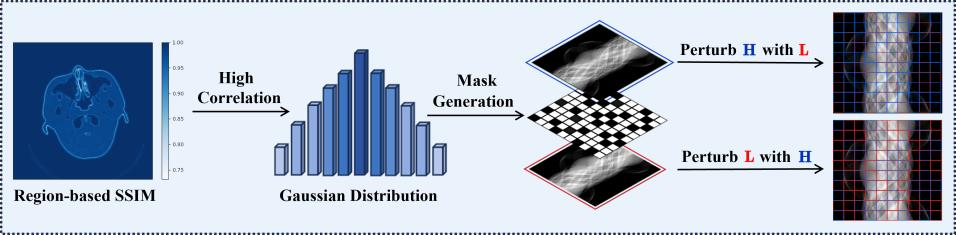
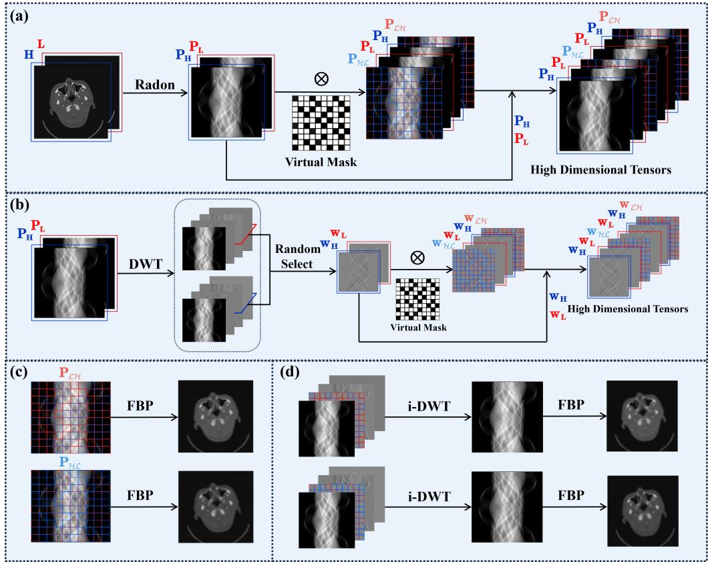
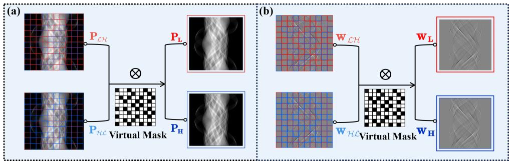
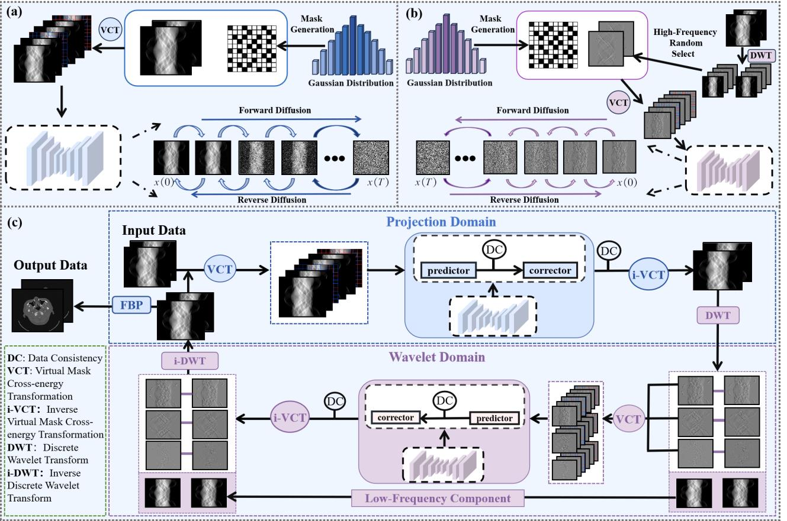
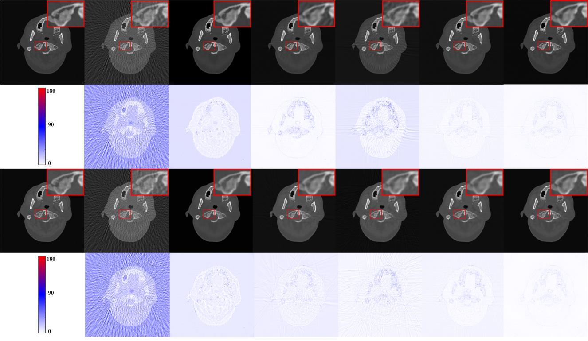
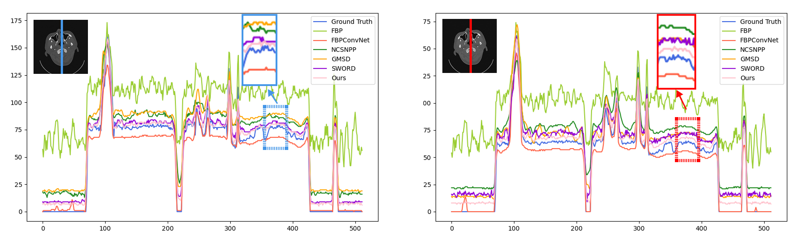
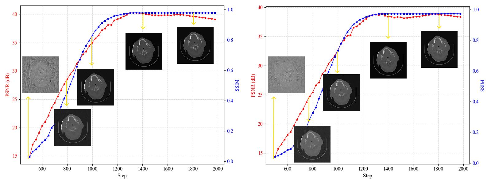

# VIP-DECT: Virtual-mask Informed Prior for Sparse-view Dual-Energy CT Reconstruction
[](https://arxiv.org/abs/2504.07753)
[](https://opensource.org/licenses/MIT)
This repository contains the PyTorch implementation of the paper **"Virtual-mask Informed Prior for Sparse-view Dual-Energy CT Reconstruction"**.
> **Code Availability:** The source code is available at [https://github.com/yqx7150/VIP-DECT](https://github.com/yqx7150/VIP-DECT).


## Abstract
Sparse-view sampling in dual-energy computed tomography (DECT) significantly reduces radiation dose and increases imaging speed, yet is highly prone to artifacts. Although diffusion models have demonstrated potential in effectively handling incomplete data, most existing methods in this field focus on the image do-main and lack global constraints, which consequently leads to insufficient reconstruction quality. In this study, we propose a dual-domain virtual-mask in-formed diffusion model for sparse-view reconstruction by leveraging the high inter-channel correlation in DECT. Specifically, the study designs a virtual mask and applies it to the high-energy and low-energy data to perform perturbation operations, thus constructing high-dimensional tensors that serve as the prior information of the diffusion model. In addition, a dual-domain collaboration strategy is adopted to integrate the information of the randomly selected high-frequency components in the wavelet domain with the information in the projection domain, for the purpose of optimizing the global structures and local details. Experimental results indicated that the present method exhibits excellent performance across multiple datasets.

Key words—Dual-energy CT, sparse-view reconstruction, virtual mask, dual-domain, collaborative strategy.

## Method Overview
<p align="center">
  
  <br>
  <em>Figure 1:Illustration of the channel correlation and its perturbationprocess. It shows the channel correlation and its perturbation process, including the correlation situation of the region-based SSIM, mask generation process, and process of using the generated mask to perturb the original tensor to obtain the perturbed tensor.</em>
</p>

<p align="center">
  
  <br>
  <em>Figure 2:Illustrationof the virtual mask cross-energy transformation. (a)VCT process inprojection domain. (b) VCT process in wavelet domain, (c) The corresponding imagefrom the perturbated projection domain, (d)The corre-sponding imagefrom the perturbated wavelet domain.</em>
</p>

<p align="center">
  
  <br>
  <em>Figure 3:The process of inverse mutual perturbation transformation. (a)Projectiondomain,(b) Wavelet domain.</em>
</p>

<p align="center">
  
  <br>
  <em>Figure 4:The training stage and iterative reconstruction stage of the proposed VIP-DECT method. (a) Training scheme of PPM (b) Training scheme of WPM,(c) Reconstruction stage.</em>
</p>

## Results
<p align="center">
  
  <br>
  <em>Figure 5:Reconstruction results from 60 views on the head DECT dataset. The first and third rows show H-energy and L-energy reconstructed images, while the second and fourth rows show residuals between reference and reconstructed  images, with the display window set to the range of [0, 220] HU. (a) The reference image versus the images reconstructed by (b) FBP, (c) FBPConvNet, (d) NCSN++, (e) GMSD, (f) SWORD, and (g) VIP-DECT.</em>
</p>

<p align="center">
  
  <br>
  <em>Figure 6:Reconstruction results from 90 views on the head DECT dataset. The first and third rows show H-energy and L-energy reconstructed images, while the second and fourth rows show residuals between reference and reconstructed images, with the display window set to the range of [0, 180] HU. (a) The reference image versus the images reconstructed by (b) FBP, (c) FBPConvNet, (d) NCSN++, (e) GMSD, (f) SWORD, and (g) VIP-DECT</em>
</p>

<p align="center">
  
  <br>
  <em>Figure 7:Reconstruction results from 60 views on the mouse thoracic DECT dataset. The first and third rows show H-energy and L-energy reconstructed images, while the second and fourth rows show residuals between reference and reconstructed images, with the display window set to the range of [0, 180] HU. (a) The reference image versus the images reconstructed by (b) FBP, (c) FBPConvNet, (d) NCSN++, (e) GMSD, (f) SWORD, and (g) VIP-DECT.</em>
</p>

<p align="center">
  
  <br>
  <em>Figure 8:Comparison of profile analyses for reconstruction results of different methods in sparse-view reconstruction onthe head DECT dataset. Sub-figures (a) and (b) show the numerical curves of reconstruction for different profiles in H-energy and L-energy channels. Curves of different colors denote different reconstruction methods</em>
</p>

<p align="center">
  
  <br>
  <em>Figure 9:PSNR and SSIM values and intermediate samples in the iterative process of (a) H-energy and (b) L-energy DECT.</em>
</p>

## Acknowledgements
This work was supported by the National Natural Science Foundation of China 62122033 and the Key Research and Development Program of Jiangxi Province 20212BBE53001.


## Citation
```bibtex
If you find this work useful, please cite our paper:
@article{chen2025vipdect,
  title={Virtual-mask Informed Prior for Sparse-view Dual-Energy CT Reconstruction},
  author={Chen, Zini and Xiao, Yao and Zhang, Junyan and Wang, Shaoyu and Shi, Liu and Liu, Qiegen},
  journal={arXiv preprint arXiv:2504.07753},
  year={2025}
}

